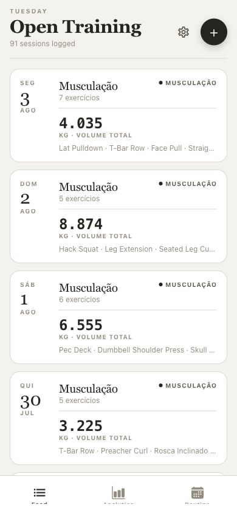
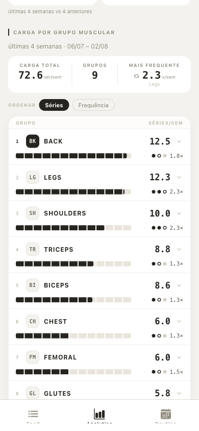
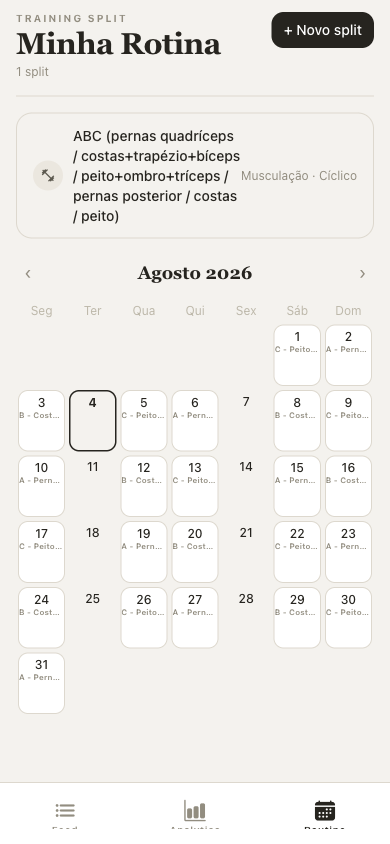
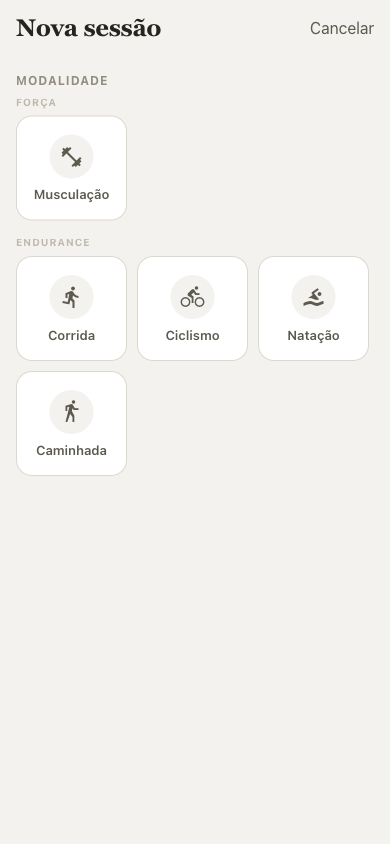
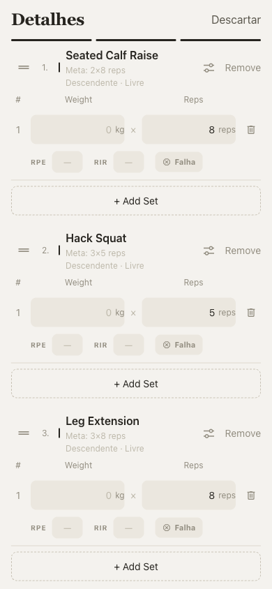
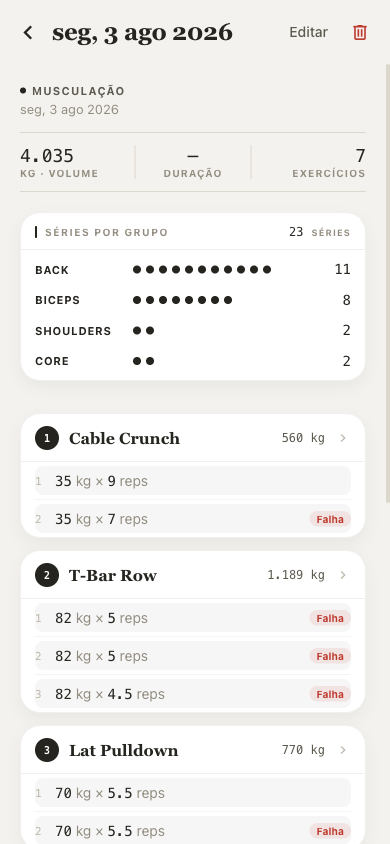
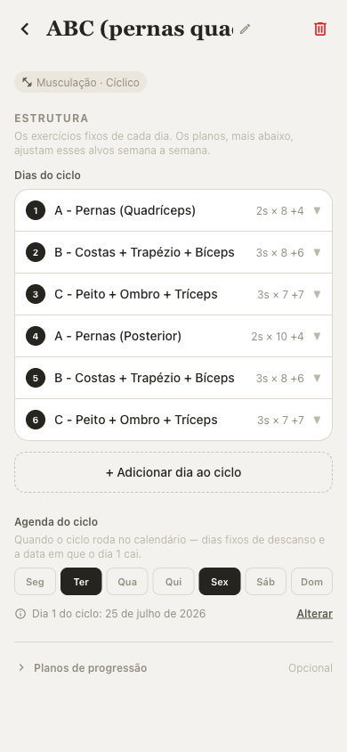
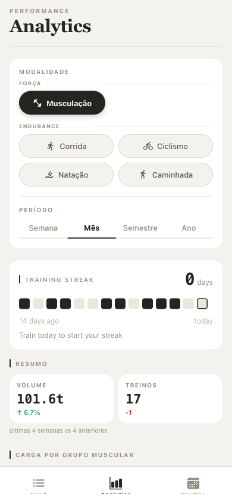
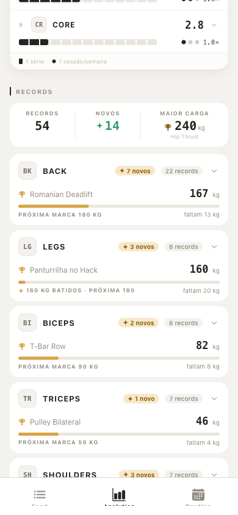
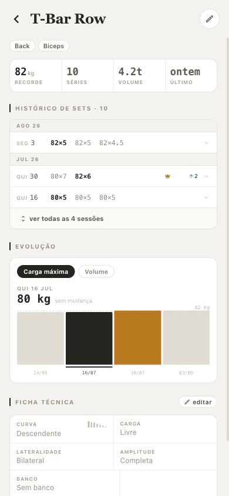

# open-training

> Diário de treino auto-hospedado. Roda no celular (Android/iOS) e no navegador, guarda tudo localmente e não fala com servidor nenhum.

<p align="center">
  
  
  
</p>

---

## Objetivo

Planilha de treino é ruim de preencher na academia e pior de analisar depois. Aplicativo de academia comercial resolve o preenchimento, mas cobra assinatura, exige login e leva seus dados para a nuvem de alguém.

**open-training** é o meio: um logbook de treino pessoal que **você** hospeda.

- **Auto-hospedado e offline-first.** Zero chamadas de rede para serviços externos. O banco é um SQLite local — no dispositivo no mobile, em WASM/IndexedDB no navegador.
- **Sem autenticação.** Single-user por design: quem hospeda é quem treina, e é dono de todo o dado.
- **Paridade web.** Toda funcionalidade que existe no celular funciona no browser — não é um app mobile com um site de brinde.
- **Registrar rápido, analisar de verdade.** Logar uma série tem que ser rápido no meio do treino; a análise (volume, séries por grupo muscular, recordes, streak) vem de graça depois.
- **Seus dados são portáteis.** Export/import em JSON versionado, backup local, sem lock-in.

---

## Funcionalidades

### Feed de sessões

Histórico cronológico com volume total, número de exercícios e prévia dos movimentos de cada sessão.


### Registrar uma sessão

Wizard curto: modalidade → split → dia do ciclo → detalhes. Se o dia previsto for descanso, o app avisa e deixa registrar mesmo assim.

Cada exercício vem com a **meta do plano** (`2×8 reps`), a ficha técnica resolvida (curva de resistência, tipo de carga) e um logger enxuto: peso, reps, RPE, RIR e marcação de **falha**. Fotos podem ser anexadas à sessão.

<p>
  
  
  
</p>

**Modalidades suportadas** — Força: musculação. Endurance: corrida, ciclismo, natação, caminhada (com distância, duração e pace reais em vez de séries e reps).

### Séries por grupo muscular

Cada exercício declara os grupos musculares que trabalha e um **fator de contagem** (1.0 para grupo primário, 0.5 para auxiliar). A sessão pronta mostra as séries creditadas a cada grupo em pips — dá para ver de olho se o treino bateu o alvo de costas sem contar linha por linha.

### Rotina: splits e programas

Split cíclico ou semanal, com dias fixos de descanso e a data em que o dia 1 do ciclo cai. O calendário projeta o ciclo para frente e mostra qual unidade cai em cada dia.

Cada dia do ciclo tem sua lista fixa de exercícios (reordenável por arrastar) e, opcionalmente, **planos de progressão** — alvos de série/reps que mudam semana a semana.

<p>
  
  
</p>

### Analytics

<p>
  
  
  
</p>

- **Filtro por modalidade e período** (semana / mês / semestre / ano).
- **Training streak** — os últimos 14 dias em pips, com a sequência atual.
- **Resumo comparativo** — volume e número de treinos do período contra o período anterior.
- **Carga por grupo muscular** — séries/semana por grupo, ordenável por séries ou por frequência, com a barra de carga e o número de sessões/semana que atingem o grupo.
- **Records** — recorde de carga por grupo muscular e por exercício, com selo de recorde novo, próxima marca de placa a bater e quanto falta.

Tudo é **descritivo**. O app não prescreve treino nem dá conselho — só mostra o que você fez.

### Exercício em detalhe

Recorde, séries totais, volume e data do último treino; histórico de sets sessão a sessão com a coroa no PR; gráfico de evolução (carga máxima ou volume); e a ficha técnica editável.



A biblioteca começa com ~70 exercícios pré-cadastrados; exercícios customizados podem ser criados, editados (nome, grupos, configuração) e arquivados. Edições propagam para o histórico, mas cada sessão **congela** a configuração e os grupos musculares vigentes no dia — histórico antigo não é reescrito por uma edição de hoje.

### Backup

`Configurações → Exportar / Importar dados`: um JSON com todo o histórico, exercícios, splits e programas. O import é **aditivo** e deduplicado por `uuid` — dá para juntar dados de dois dispositivos sem duplicar sessão.

---

## Tecnologias

| Camada | Escolha |
| --- | --- |
| Framework | [Expo 52](https://docs.expo.dev/) (managed workflow) + React Native 0.76 |
| Navegação | [Expo Router 4](https://docs.expo.dev/router/introduction/) — rotas por arquivo, mesmas rotas nas 3 plataformas |
| Web | React Native Web (`web.output: "single"`, SPA sem SSR) |
| Banco | [expo-sqlite 15](https://docs.expo.dev/versions/latest/sdk/sqlite/) — API síncrona; driver WASM no navegador |
| Estilo | [NativeWind v4](https://www.nativewind.dev/) + Tailwind CSS v3 |
| Gráficos | Victory Native 41 + [@shopify/react-native-skia](https://shopify.github.io/react-native-skia/) |
| Gestos | react-native-gesture-handler + Reanimated 3 + react-native-sortables |
| Linguagem | TypeScript |
| Testes | Jest (unidades de agregação, migrações e queries com SQLite em memória) |

Detalhes de arquitetura, convenções e as três amarrações obrigatórias do NativeWind estão em [`CLAUDE.md`](CLAUDE.md).

---

## Rodando

```bash
npm install

# dev server — pressione w (web), a (Android), i (iOS)
npx expo start

# só web
npx expo start --web
```

Build de produção:

```bash
# bundle web estático (sirva a pasta dist/ com qualquer servidor)
npx expo export --platform web

# APK Android assinado, build local
make android-release
```

`make help` lista os alvos de Android (prebuild, debug, release, install, clean).

Qualidade:

```bash
npx tsc --noEmit     # types
npx eslint .         # lint
npx jest             # testes
```

---

## Estrutura

```
app/                  # rotas do Expo Router
  (tabs)/             # Feed · Analytics · Routine
  session/            # nova sessão (wizard + logger) e detalhe
  routine/            # splits, dias do ciclo, programas de progressão
  exercises/[id].tsx  # histórico e ficha técnica do exercício
src/
  db/                 # SQLite singleton, schema, migrações, queries tipadas, export/import
  hooks/              # useSessions, useExercises, useRoutine, useAnalytics, …
  components/         # UI compartilhada (SetLogger, RoutineCalendar, AnalyticsRecords, …)
  utils/              # agregações puras e testáveis (volume, séries, records, ciclo)
  data/               # registry de modalidades + exercícios seed
docs/superpowers/specs # documentos de design por feature
```

Regra dura: **SQL só existe em `src/db/`**. Todo o resto passa por `queries.ts`.

---

## Roadmap

O plano de evolução em três horizontes está em **[docs/superpowers/specs/2026-07-23-roadmap.md](docs/superpowers/specs/2026-07-23-roadmap.md)**.

Resumo:

- **Short-term** — generalizar a arquitetura de modalidade (registry + `targetKind`), edição completa de exercícios, mais configurações por exercício, métricas de volume por modalidade, perfil single-user, exports inteligentes (CSV/PDF, cards compartilháveis), fundação de design system.
- **Medium-term** — temas dark/light, customizações de UI, e o começo de mapas/GPS para as modalidades de endurance.
- **Long-term** — backend analítico com sync, múltiplos dispositivos/usuários e recomendações de treino com IA.

Os designs individuais de cada feature já entregue ficam em [`docs/superpowers/specs/`](docs/superpowers/specs/).

---

## Nota

Projeto pessoal, feito para um usuário só. Os prints deste README são de um banco real com ~90 sessões importadas de 2 anos de histórico de treino.
